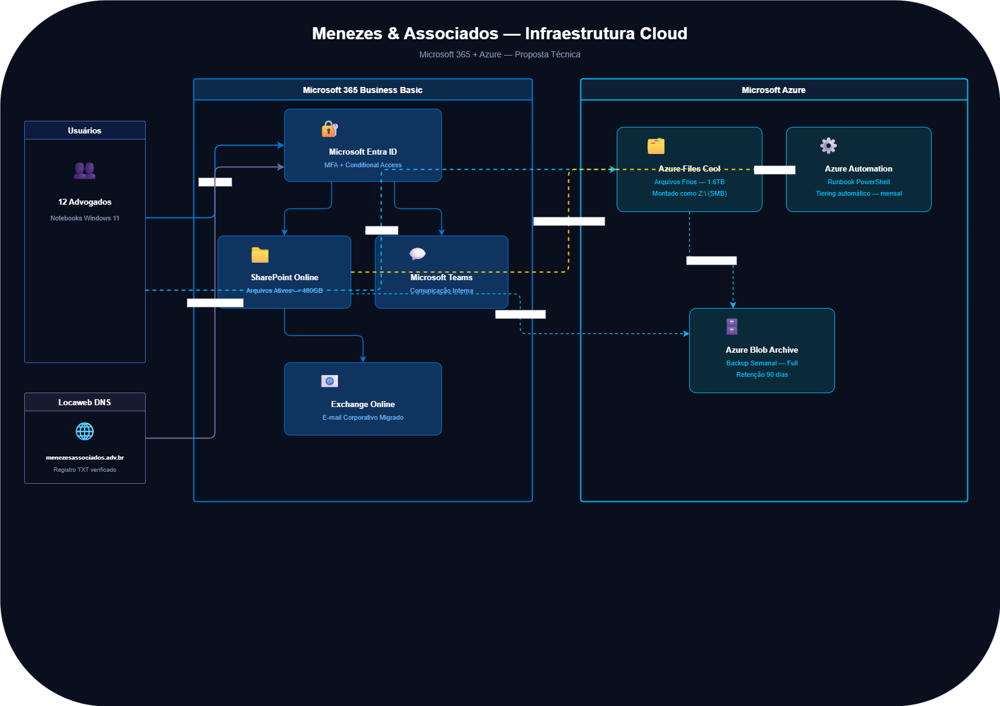

# ☁️ Menezes & Associados — Cloud Infrastructure

> **Simulação de projeto real** | Migração de infraestrutura on-premises para Microsoft 365 + Azure para escritório de advocacia com 12 usuários.

---

## 📋 Contexto

Escritório de advocacia operando com servidor físico legado, arquivos compartilhados via pen drive e e-mail pessoal, sem backup estruturado e sem controle de acesso. Este projeto simula o trabalho de um Cloud Engineer freelancer contratado para modernizar a infraestrutura com foco em **segurança**, **rastreabilidade de acesso** e **custo controlado**.

**Requisitos do cliente:**
- Controle de quem acessa cada arquivo
- Backup confiável (já perderam processo por arquivo corrompido)
- Solução acessível — budget de R$ 800/mês
- Zero dependência técnica para operação do dia a dia

---

## 🏗️ Arquitetura



### Decisões técnicas

| Problema | Solução | Justificativa |
|---|---|---|
| Sem identidade centralizada | Microsoft Entra ID + MFA | Cloud-native, sem necessidade de AD on-prem |
| Arquivos ativos sem controle | SharePoint Online | Auditoria nativa, versionamento, acesso por browser |
| 1.6TB de arquivos históricos | Azure Files Cool (Z:\) | Acesso SMB familiar para usuários, sem treinamento |
| Tiering manual insustentável | Azure Automation + PowerShell | Runbook mensal move arquivos inativos automaticamente |
| Sem backup estruturado | Azure Blob Archive | Backup semanal, retenção 90 dias, custo mínimo |
| E-mail pessoal para trabalho | Exchange Online | Migração do domínio existente, zero impacto para usuários |

---

## 🗂️ Estrutura do Repositório

```
menezes-associados-cloud-infra/
├── docs/
│   └── menezes-arquitetura.png     # Diagrama de arquitetura
├── modules/
│   ├── storage/                    # Azure Files + Blob Archive
│   │   ├── main.tf
│   │   ├── variables.tf
│   │   └── outputs.tf
│   └── automation/                 # Azure Automation + Runbook
│       ├── main.tf
│       ├── variables.tf
│       └── outputs.tf
├── environments/
│   └── menezes/
│       ├── main.tf                 # Entry point do ambiente
│       ├── variables.tf
│       └── terraform.tfvars.example
├── scripts/
│   └── tiering-runbook.ps1        # PowerShell — tiering automático mensal
├── backend.tf                     # State remoto no Azure Storage Account
├── providers.tf                   # AzureRM provider config
└── README.md
```

---

## 🔧 Stack Técnica

**Microsoft 365 Business Basic**
- Microsoft Entra ID — identidade + MFA + Conditional Access
- SharePoint Online — arquivos ativos (400GB)
- Microsoft Teams — comunicação interna
- Exchange Online — e-mail corporativo

**Microsoft Azure**
- Azure Files (tier Cool) — arquivos históricos 1.6TB, montado como `Z:\`
- Azure Automation + Runbook PowerShell — tiering automático mensal
- Azure Blob Storage (tier Archive) — backup semanal, retenção 90 dias

**IaC & Automação**
- Terraform — provisionamento de recursos Azure
- GitHub Actions — pipeline de CI/CD (plan no PR, apply no merge)
- PowerShell — runbook de tiering

---

## 🚀 Como usar

### Pré-requisitos

- Terraform >= 1.5
- Azure CLI autenticado (`az login`)
- Subscription Azure ativa
- Licenças M365 Business Basic provisionadas

### Deploy

```bash
# 1. Clone o repositório
git clone https://github.com/brunokdalcastel/lab-azure-advocacia-infra


# 2. Configure o backend (Storage Account para o state)
# Siga as instruções em docs/backend-setup.md

# 3. Configure as variáveis
cp environments/menezes/terraform.tfvars.example environments/menezes/terraform.tfvars
# Edite o arquivo com seus valores

# 4. Inicialize e aplique
cd environments/menezes
terraform init
terraform plan
terraform apply
```

---

## 📐 Fluxo de Dados

```
Advogado faz login
    └── Entra ID valida identidade + MFA
        ├── Acessa SharePoint (arquivos ativos)
        ├── Acessa Teams (comunicação)
        └── Acessa Exchange (e-mail)

Azure Automation (mensal)
    └── Verifica arquivos no SharePoint sem acesso > 24 meses
        └── Move automaticamente → Azure Files Cool (Z:\)

Backup semanal
    ├── SharePoint → Azure Blob Archive
    └── Azure Files → Azure Blob Archive
        └── Retenção: 90 dias
```

---

## 📌 Escopo IaC (Terraform)

O Terraform gerencia exclusivamente os recursos **Microsoft Azure**. A configuração do Microsoft 365 (Entra ID, SharePoint, Teams, Exchange) é realizada via **M365 Admin Center** e documentada como runbook operacional — essa é uma decisão intencional, pois recursos M365 têm ciclo de vida independente da infraestrutura Azure.

| Recurso | Gerenciado por |
|---|---|
| Resource Group | Terraform |
| Storage Account | Terraform |
| Azure File Share | Terraform |
| Blob Container | Terraform |
| Automation Account | Terraform |
| Runbook PowerShell | Terraform + script externo |
| Entra ID / M365 | Manual — M365 Admin Center |

---

## 👤 Autor

**Bruno Castel**

> Este projeto é uma simulação para fins de portfólio e aprendizado. Dados e nomes de clientes são fictícios.
